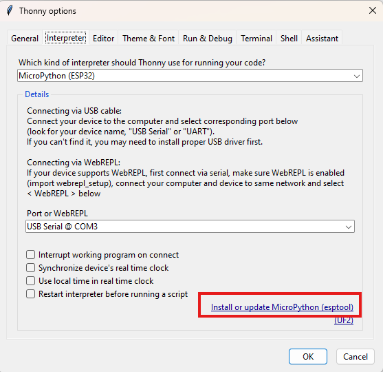

# Getting Started with Thonny MicroPython (Python) IDE for ESP32 and ESP8266

## Installing Thonny IDE
In this guide, we provide instructions to install Thonny IDE in different operating systems, read the section that fits your needs:
- https://randomnerdtutorials.com/getting-started-thonny-micropython-python-ide-esp32-esp8266/#install-thonny-ide-windows

## Flashing MicroPython Software
MicroPython isn’t flashed onto the ESP32 or ESP8266 boards by default. The first thing you need to do to start programming your boards with MicroPython is flash/upload/burn the firmware.

There are different ways in which you can do that. Thonny IDE comes with a tool that allows you to quickly install MicroPython firmware on your board. 

### Flashing MicroPython Firmware using Thonny IDE
In this section, you’ll learn how to flash MicroPython firmware on your boards using Thonny IDE. Follow the next steps:

1) Connect your ESP32 or ESP8266 board to your computer.

2) Open Thonny IDE. Go to Tools > Options > Interpreter.

3) Select the interpreter you want to use accordingly to the board you’re using and select the COM port your board is connected to. Finally, click on the link Install or update firmware.

4) Select the port once again, and then click on the Browse button to open the .bin file with the firmware you’ve downloaded on the previous step. Select the options as shown in the picture below and finally click on Install

After a few seconds, the installation should be completed.

## Testing the Installation
Connect the board to your computer using a USB cable. To test the installation, you need to tell Thonny that you want to run MicroPython Interpreter and select the board you are using.

1. Go to Tools > Options and select the Interpreter tab. Make sure you’ve selected the right interpreter for your board as well as the COM port.

You can also select the “Try to detect automatically” option, but only if you just have one board connected to your computer at a time. Otherwise, select the specific port for the board you’re using.

2. Thonny IDE should now be connected to your board and you should see the prompt on the Shell.

3. Type the command help() in the Shell and see if it responds back.

If it responded back, everything is working fine.